# CAS ENGINE — Sistema Task Unificato
## Controllo Avanzamento verso HP Prime G2

> Aggiornato: 2026-05-15b (Frobenius + L2-22 residui + L2-11 PV + L3-04 Gamma/erf + L3-06 simplify_polynomial_in_x_over_q_alpha)
> Progetto: REAL CAS ENGINE C++  
> Protocollo: Unificato Anti-Hardcode (Rigorosa validazione simbolica)

**Regola invariabile**: Finché esistono P0/L0 aperti, nessun agente lavora su livelli superiori.  
**Criterio "Risolta"**: Capacità generalizzabile + test robusti + test anti-hardcode + nessun hardcode + regressioni ok.

---

## 1. GAP INVENTORY COMPLETO (vs HP Prime G2)

1. **Floating-point**: Nessun tipo Float simbolico maturo (Score 1). → CAS-L3-01, CAS-L3-03
2. **Numeri complessi**: Struttura presente, operazioni e polar/log minimi (Score 2). → CAS-L2-08
3. **Precisione Numerica**: Mancanza di MPFR o precisione arbitraria (Score 2). → CAS-L3-01
4. **Canonicalizzazione**: Assente per funzioni trascendenti (Score 3). → CAS-L1-07
5. **Fattorizzazione EDF**: Caso `p=2` non gestito in Equal Degree Factorization. → CAS-L1-04
6. **Fattorizzazione LLL**: Parametro `delta_val` hardcoded a 0.75, non configurabile. → CAS-L0-03
7. **Fattorizzazione Recombination**: Nessun timeout, rischio esplosione complessità. → CAS-L0-04
8. **Fattorizzazione Galois**: Trager su estensioni algebriche presente ma ancora parziale; toolkit Galois assente (Score 1). → CAS-L3-06, CAS-L3-18
9. **GCD Multivariato**: Non implementato pienamente (Score 2). → CAS-L1-08
10. **Semplificazione e Algebra RootOf**: `RootOf` non è più inerte, ma l'algebra di campo `Q(alpha)` non è ancora integrata nel simplifier/linalg generale. → CAS-L1-05
11. **Equazioni trascendenti**: Risolutori per equazioni trascendenti (es. `sin(x)=x/2`) assenti (Score 0). → CAS-L2-06
12. **Groebner F4**: Inefficienza O(N^2 log N) in `register_monomial`. → CAS-L0-06
13. **Sistemi Disequazioni**: CAD (Cylindrical Algebraic Decomposition) assente (Score 0). → CAS-L3-02
14. **Identità Trigonometriche**: Framework parziale (Score 2). → CAS-L2-07
15. **Semplificazione Trigonometrica**: Funziona solo su angoli multipli di π/12. → CAS-L2-10
16. **Domini e Assumptions**: `assume(condition)` incompleto, manca deduzione/inferenza. → CAS-L0-07
17. **Limiti (MRV)**: Torri esponenziali e cancellazioni MRV coperte dai test attuali; resta da dimostrare completezza Gruntz generale oltre la copertura. → CAS-L1-01
18. **Integrazione (Risch)**: Bail-out su estensioni trascendenti. → CAS-L1-02
19. **Integrazione (LRT)**: Droppa radici algebriche, manca `RootSum`. → CAS-L1-03
20. **Integrazione Definita**: Non gestisce poli/singolarità nel dominio. → CAS-L1-06
21. **Serie di Laurent**: Assenti, blocco per residui. → CAS-L2-05
22. **Autovalori Simbolici n>3**: Bloccati da RootOf inerte. → CAS-L2-02
23. **Algebra Lineare (Jordan)**: ~~`extend_basis` non definita~~ → **RISOLTO** (matrix_jordan.cpp implementato). → CAS-L2-03
24. **Algebra Lineare (Smith)**: ~~stub `Unimplemented`~~ → **RISOLTO** (smith_normal_form implementato). → CAS-L2-04
25. **Funzioni Speciali**: Gamma, Bessel, Legendre, Zeta assenti (Score 0). → CAS-L3-04
26. **Unità di Misura**: Sistema SI assente (Score 0). → CAS-L3-08
27. **Summazione Simbolica**: Zeilberger è uno stub (Score 1). → CAS-L3-05
28. **ODE > 1° Ordine**: Risolutori e Variazione Parametri/Frobenius assenti. → CAS-L2-01
29. **Integrali Multipli**: Assenti (Score 0). → CAS-L2-09
30. **Trasformate**: Laplace e Fourier assenti (Score 0). → CAS-L3-07
31. **Test Coverage**: `test_debug_limit` privo di asserzioni reali. → CAS-L0-01
32. **Test Framework**: Mancano test property-based, randomizzati e anti-hardcode (Score 0). → CAS-L0-02, CAS-L0-08

---

## 2. TABELLA MASTER TASK

| ID | Area | Titolo | Priorità | Stato | Dipendenze | Impatto G2 | Prossima Azione |
|---|---|---|---|---|---|---|---|
| CAS-L0-01 | QA | Asserzioni Limiti | L0 | Risolta | — | Basso | Verificata |
| CAS-L0-02 | QA | Test Property-Based | L0 | Risolta | — | Alto | Verificata |
| CAS-L0-08 | QA | Test Randomizzati Anti-Hardcode | L0 | Risolta | L0-02 | Alto | Verificata |
| CAS-L0-03 | Algebra | LLL Configurabilità | L0 | Risolta | — | Medio | Verificata |
| CAS-L0-04 | Algebra | Recombination Timeout | L0 | Risolta | — | Medio | Verificata |
| CAS-L0-05 | Algebra | Seed CZ Variabile | L0 | Risolta | — | Medio | Verificata |
| CAS-L0-06 | Algebra | Ottimizzazione F4 | L0 | Risolta | — | Alto | Verificata |
| CAS-L0-07 | Symbolic | Interfaccia Assumptions | L0 | Risolta | — | Alto | Verificata |
| CAS-L0-09 | Polynomial | Modulo primo custom (oltre p=13) | L0 | Risolta | — | Basso | Verificata |
| CAS-L0-10 | QA | Cycle Detection Framework | L0 | Risolta | — | Medio | Verificata |
| CAS-L0-11 | Performance | Performance Instrumentation Hooks | L0 | Risolta | — | Basso | Verificata |
| CAS-L0-12 | Symbolic | Profondità Semplificazione Adattiva | L0 | Risolta | L0-10 | Medio | Verificata |
| CAS-L0-13 | Performance | Timeout Check Interval Configurabile | L0 | Risolta | — | Basso | Verificata |
| CAS-L0-14 | Parser | Conversione Automatica DecimalLit→Rational | L0 | Risolta | — | Medio | Verificata |
| CAS-L1-01 | Calculus | Gruntz MRV Completo | L1 | Parziale avanzata | L0-01 | Molto Alto | `GruntzTest.*`, `LimitMrvTest.*` e `AcidTest.Test1_GruntzLimit` passano; aggiunta valuation Laurent/quozienti. Non promossa a Risolta finché manca prova/corpus più ampio su Gruntz generale |
| CAS-L1-02 | Calculus | Risch Trascendente | L1 | Parziale avanzata | L1-01 | Molto Alto | **2026-05-15**: Aggiunto `integrate_log_polynomial_part` in `integrate_risch.cpp`: ∫ Σ a_k(x)·t^k dx con t=ln(u) risolto via ricorsione discendente b_k = ∫[a_k - (k+1)·b_{k+1}·u'/u] dx. Funziona: ∫x·ln(x), ∫ln(x)², ∫x²·ln(x), ∫(2x+3)·ln(x) (6/6 oracle test via diff∘integrate). Esistente: exp per-k Risch DE, Hermite reduction, Rothstein-Trager. Resta: Hermite/Trager su torri con estensioni log/exp profonde, estensioni composte exp(ln²), e mix log-exp simultanei. |
| CAS-L1-03 | Calculus | RootSum in LRT | L1 | Risolta | L1-05 | Alto | Verificata |
| CAS-L1-04 | Algebra | EDF p=2 | L1 | Risolta | — | Medio | Verificata (trace polynomial branch in equal_degree_factorization per p=2, test FactorPolynomialP2 × 3) |
| CAS-L1-05 | Symbolic | RootOf Algebra/Eval | L1 | Parziale avanzata | — | Alto | **2026-05-15**: Bridge `RootOf↔AlgebraicNumber` completato (`include/cas/algebraic_number_bridge.hpp`): `rootof_min_poly`, `alpha_from_rootof`, `try_express_in_q_alpha`, `algebraic_number_to_expr[_raw]`, `try_reduce_in_q_alpha`, `simplify_in_q_alpha`. 17 test bridge passano (sqrt(2), cuberoot(2), divisioni, round-trip). RootOf^n via poly remainder già OK; eval numerico base OK; bridge usato in `null_space_over_extension`. Resta: auto-trigger del bridge nel simplifier pubblico (post-pass) ed estensione a generatori radicali (Pow(c, 1/n), sqrt) per allargare coverage. |
| CAS-L1-06 | Calculus | Singolarità Definiti | L1 | Parziale | — | Alto | Poli razionali finiti interni/endpoint rifiutati ok; rimovibili cancellabili ok; mancano radici algebriche, singolarità trascendenti, impropri/PV |
| CAS-L1-07 | Symbolic | Normal Form Trascendente | L1 | Risolta | — | Alto | Verificata (transcendental_normal_form: ln Product/Binary/Div/Pow expand + exp/ln inv. cancellazioni, 5 test anti-hardcode) |
| CAS-L1-08 | Algebra | GCD Multivariato | L1 | Parziale | — | Alto | Hardcode `depth > 16U` → `ctx.max_gcd_recursion_depth()` e `8U` min steps → `ctx.min_gcd_division_steps()` rimossi. **2026-05-08**: GCDHEU non accetta più candidati con `return true`, ma certifica con divisione esatta multivariata. Modular GCD/Hensel multivariato generale ancora aperto. |
| CAS-L1-09 | Symbolic | Deduzione Disequazioni da Assunzioni | L1 | Risolta | L0-07, L1-10 | Molto Alto | Verificata (is_nonzero deriva da grafo relazionale, x*y>0 inferito, transitività 3-hop, 6 test anti-hardcode) |
| CAS-L1-10 | Symbolic | Domini Globali e Coerenza Assunzioni | L1 | Risolta | L0-07 | Alto | Verificata |
| CAS-L1-11 | Calculus | Asintoti (vertical/horizontal/oblique) | L1 | Risolta | — | Medio | Verificata (x→-∞ aggiunto, deduplicazione simmetrica, test anti-hardcode) |
| CAS-L1-12 | Symbolic | Semplificazione radicali annidati (denesting) | L1 | Risolta | — | Medio | Verificata (extract_square_factor algoritmo generale: sqrt(12)→2sqrt(3), sqrt(75)→5sqrt(3), sqrt(144)→12; 3 test anti-hardcode) |
| CAS-L1-13 | Symbolic | Semplificazione abs/sign avanzata | L1 | Risolta | L0-07, L1-10, L1-12 | Medio | Verificata |
| CAS-L1-14 | Calculus | Composizioni Inverse (sqrt∘sqrt, sin∘arcsin) | L1 | Risolta | L1-13 | Medio | Verificata (sin/cos/tan(arc*) + arc*(sin/cos/tan) con assumptions, sqrt∘sqrt, test_compositions.cpp 3/3) |
| CAS-L1-15 | Algebra | Resultante e Discriminante | L1 | Risolta | — | Medio | Verificata (normalizzazione via ctx.simplify() applicata, test anti-hardcode L1-15) |
| CAS-L1-16 | Symbolic | Caching/Memoization Expression | L1 | Risolta | — | Medio | Verificata (LRU + metriche + eviction configurabile + GC-safe, 5 test CASCachingTest) |
| CAS-L1-17 | LinAlg | Pivot Bareiss Euristica Contestuale | L1 | Risolta | — | Medio | Verificata |
| CAS-L1-18 | Calculus | Budget Integrazione Configurabile | L1 | Risolta | L1-02 | Alto | Verificata |
| CAS-L1-19 | Algebra | GCD Euristico Padding Adattivo | L1 | Risolta | L1-08 | Medio | Verificata |
| CAS-L1-20 | Algebra | Valutazione Multivariata su Q | L1 | Risolta | — | Alto | Verificata (evaluate_at_rational, parziale: variabili residue non ancora supportate) |
| CAS-L1-21 | Algebra | Campioni GCD Confidence-Based | L1 | Risolta | L1-08 | Basso | Verificata |
| CAS-L2-01 | Calculus | ODE 2° Ordine e Ordine N | L2 | Parziale avanzata | L1-02 | Alto | **2026-05-15**: `solve_ode_frobenius_at_zero` implementato in `src/calculus/ode_solver_frobenius.cpp` con API esplicita in `include/cas/ode.hpp`. Algoritmo: p=a₁/a₂, q=a₀/a₂, p̃=x·p, q̃=x²·q canonicalizzati via `algebra::together`+`expand`+`simplify`, indicial r²+(p₀-1)r+q₀=0 via solve_polynomial, ricorrenza c_n=-Σ((n-k+r)p_k+q_k)c_{n-k}/I(n+r). Test 3/3 PASS: Euler x²y''-6y=0 → x³+x⁻²; 3x²y''-4xy'+2y=0 → x²+x^(1/3); x²y''+xy'-y=0 → x±¹. Resta: caso roots-differ-by-integer con log term (Unimplemented diagnostico), resonance generale. Var. parametri esistente non toccata. |
| CAS-L2-02 | LinAlg | Autovalori n>3 | L2 | Risolta | L1-05 | Alto | **2026-05-15**: `null_space_over_extension()` (src/linalg/matrix_null_space_extension.cpp) costruisce kernel via RREF su Q(α) usando AlgebraicNumber + bridge. `eigenvectors()` dispatcha automaticamente quando autovalore è RootOf. Test tautologico `EigenTest.EigenvaluesDimension4` riscritto: verifica esplicita `A·v - λ·v ≡ 0` su companion 4×4 x⁴-2. Test dedicato su companion 5×5 x⁵-2 + null_space diretto: 4/4 verde. |
| CAS-L2-03 | LinAlg | Jordan Form | L2 | Risolta | — | Medio | jordan_normal_form() implementata in matrix_jordan.cpp; extend_basis definita (righe 80-92); catene di Jordan via kernel iterato |
| CAS-L2-04 | LinAlg | Smith Normal Form | L2 | Risolta | — | Medio | smith_normal_form() implementata in matrix_smith.cpp; algoritmo PID con elementary divisors e extended GCD |
| CAS-L2-05 | Calculus | Serie Laurent | L2 | Aperta | L1-01 | Alto | Espansioni poli |
| CAS-L2-06 | Solving | Trascendenti Ibridi | L2 | Aperta | L1-02 | Alto | Newton-Raphson |
| CAS-L2-07 | Symbolic | Trig Identities | L2 | Aperta | — | Medio | Semplificazione trig |
| CAS-L2-08 | Complex | Polar/Log Completo | L2 | Parziale avanzata | — | Medio | **2026-05-15b**: `simplify_functions.cpp` ora gestisce `abs(a + b·i)` → `sqrt(a²+b²)` via `extract_complex`. `arg` aggiunto come BuiltinOp::Arg + parser + simplify rules: arg(0)=0, arg(positivo)=0, arg(negativo)=π, arg(i)=π/2, arg(-i)=-π/2, arg(a+bi) con a>0 → atan(b/a), a<0 → atan(b/a)±π, a=0 → ±π/2. Aggiunti special values atan(0/±1) → 0, ±π/4 + atan odd. `ln(i)=iπ/2`, `ln(-1)=iπ` (branch principale). 13/13 test ComplexPolar PASS. Resta: `ln(a+b·i)` generale = ln|z| + i·arg(z), branch cuts globali (→ L2-17), atan(√3)/atan(1/√3). |
| CAS-L2-09 | Calculus | Integrali Multipli | L2 | Aperta | L1-02, L1-06 | Alto | Integrale iterato + cambio ordine |
| CAS-L2-10 | Symbolic | Semplificazione Trig Generale | L2 | Aperta | L2-07 | Alto | Riduzione oltre multipli di `pi/12` |
| CAS-L2-11 | Calculus | Integrali Impropri e Valore Principale | L2 | Parziale | L1-06, L2-05 | Molto Alto | **2026-05-15**: `classify_improper_convergence` + `cauchy_principal_value` in `src/calculus/integrate_improper.cpp` (header `include/cas/improper_integral.hpp`). Convergenza via Laurent leading order ai finiti + sostituzione 1/u all'infinito. PV su poli semplici interni via decomposizione c_{-1}/(x-p)+regolare con integrazione di parte regolare. Test 5/5 PASS: (∫1/(1+x²) dx convergente, 1/x², 1/x divergenti, PV 1/x su [-1,1]=0, PV 1/(x-1) su [0,2]=0). Resta: poli di ordine >1 (Hadamard finite part), tipi non-razionali, classificazione integrali con singolarità trascendenti. |
| CAS-L2-12 | Analysis | Serie Padé | L2 | Aperta | L2-05 | Medio | Approssimanti razionali da Taylor |
| CAS-L2-13 | Solving | Fallback Sistemi Nonlineari | L2 | Aperta | L0-06, L1-08 | Alto | Strategia multi-metodo oltre F4 |
| CAS-L2-14 | Calculus | Integrazione sostituzione trig avanzata | L2 | Aperta | L2-10 | Medio | Oltre tan(x/2): Weierstrass+custom |
| CAS-L2-15 | Polynomial | Risolutore ciclotomica grado arbitrario | L2 | Risolta | L0-09 | Basso | Hardcode `n<=100` rimosso: `is_cyclotomic` ora usa bound dinamico `max(12, 2*(deg+1))` (coprendo n=p, n=2p per φ(p)=p-1=deg); configurabile via `ctx.max_cyclotomic_n()` per casi compositi esotici |
| CAS-L2-16 | Calculus | Cambio variabile integrali automatico | L2 | Aperta | L1-02, L2-07, L2-14 | Medio | Riconoscimento pattern + suggerimento |
| CAS-L2-17 | Complex | Logaritmo complesso multivalore e branch | L2 | Aperta | L2-08 | Medio | Riemann surface handling |
| CAS-L2-18 | Polynomial | Polinomi multivariati interpolazione avanzata | L2 | Aperta | — | Medio | Oltre Kronecker: sparse interpolation |
| CAS-L2-19 | Symbolic | Equivalenza Matematica Trascendente | L2 | Aperta | L1-07 | Alto | `are_equal` su exp/log/trig |
| CAS-L2-20 | Algebra | Groebner Buchberger Criteria | L2 | Aperta | L0-06 | Medio | Gebauer-Moeller + pair pruning |
| CAS-L2-21 | Complex | Branch Cuts Globali | L2 | Aperta | L2-17 | Medio | Policy coerente ramo principale |
| CAS-L2-22 | Calculus | Integrali Definiti via Residui | L2 | Parziale | L2-11, L2-05 | Alto | **2026-05-15**: `integrate_rational_full_real_line` in `src/calculus/residue_theorem.cpp` (header `include/cas/residue_theorem.hpp`). Pipeline: apart_num_den → degree check → factor Q su Q[x] → per ogni fattore quadratico irriducibile con Δ<0, costruisce α=RootOf, calcola residue via `simplify_in_q_alpha` + `try_express_in_q_alpha` per estrarre coefficienti, somma contributo reale `-π·f·√(-Δ)`. Test: ∫1/(1+x²)=π PASS, ∫1/(1+x²)²=π/2 PASS, real-pole + non-convergent rejection PASS. SKIP: ∫1/(1+x⁴)=π/√2 perché richiede splitting di fattore quartico irriducibile su Q (necessita Q(α) per α generatore). Resta: fattori irriducibili grado ≥3 via chiusura algebrica + RootSum. |
| CAS-L2-23 | Calculus | Jacobian e Hessian | L2 | Risolta | — | Medio | jacobian() e hessian() implementati in differentiate.cpp; gradient e partial_diff funzionanti |
| CAS-L2-24 | Complex | Aritmetica su Z[i] e Estensioni | L2 | Aperta | — | Basso | Operazioni su interi gaussiani |
| CAS-L2-25 | Groebner | Reduced Groebner e Gröbner Basis Completa | L2 | Aperta | L2-20 | Medio | Unique representation e strong Groebner |
| CAS-L2-26 | Symbolic | Piecewise e Case Analysis | L2 | Aperta | L1-10 | Medio | Espressioni condizionali + simplificazione |
| CAS-L2-27 | Calculus | Serie Taylor Generatore Sistematico | L2 | Risolta | L2-05 | Alto | **2026-05-15**: `taylor_series` ha già fallback generico via `diff(f, x, k)` + `substitute(x=x0)` (`limit_series.cpp:308-368`); la tabella Maclaurin è solo fast-path. Test aggiunti: `tan(x)` ordine 5, `1/(1-x²)` ordine 6 — entrambi via fallback generale, 8/8 verde. Limitazione residua nota: composizioni profonde tipo `exp(sin(x))` ordine >2 stallano per limiti del simplifier sulle derivate alte (gap simplifier, non Taylor). |
| CAS-L3-01 | Numeric | MPFR Integrazione | L3 | Aperta | — | Alto | Wrapping mpfr_t, prerequisito L3-03/13/17 |
| CAS-L3-02 | Analysis | CAD Disequazioni | L3 | Aperta | L0-06 | Molto Alto | Cylindrical Decomp |
| CAS-L3-03 | Numeric | Float Simbolico Contestuale | L3 | Aperta | L3-01 | Medio | Contesto precisione + rounding mode |
| CAS-L3-04 | SpecialFn | Funzioni Speciali Core | L3 | Parziale avanzata | L1-02 | Molto Alto | **2026-05-15b**: Esteso `simplify_functions.cpp`: Gamma(n)=(n-1)! per n int positivo, Gamma(1/2)=√π + ricorsione half-integer (Gamma(3/2)=√π/2, Gamma(-1/2)=-2√π, Gamma(5/2)=3√π/4), equazione funzionale Gamma(z+n), erf odd erf(-x)=-erf(x). **Zeta**: ζ(0)=-1/2, ζ(-1)=-1/12, ζ(-3)=1/120, ζ(-5)=-1/252, ζ(-7)=1/240, ζ(-2k)=0 (zeri triviali), ζ(2)=π²/6, ζ(4)=π⁴/90, ζ(6)=π⁶/945, ζ(8)=π⁸/9450, ζ(10)=π¹⁰/93555, ζ(12)=691π¹²/638512875. Derivative rules: erf', Gamma' (polygamma), Bessel J/Y/I/K via ricorrenza. 16/16 test PASS. Resta: Gamma reflection (Gamma(z)·Gamma(1-z)=π/sin(πz)), Bessel ortogonalità, Legendre P_n, ζ(2k) via Bernoulli per k>6. |
| CAS-L3-05 | Calculus | Zeilberger | L3 | Aperta | L1-01 | Medio | Summazione ipergeometrica |
| CAS-L3-06 | Algebra | Fattorizzazione su Estensioni | L3 | Parziale avanzata | L1-04, L1-05, L3-14 | Molto Alto | Fattori in Q(a) e splitting; 2026-05-08: rimosso bound Trager fisso `s < 10`/fallback `s > 5`. **2026-05-15**: 5/5 famiglie certificate (x²-2 su Q(√2), x²+1 su Q(i), x⁴-5x²+6 su Q(√2), x³-2 su Q(∛2), x³-3x+1 su Q(α) con α=stessa radice). Aggiunto `simplify_polynomial_in_x_over_q_alpha(expr, poly_var, ctx)` in bridge (parse poly-in-x → reduce ciascun coefficiente via try_reduce_in_q_alpha → rebuild) per certificare correttezza di Trager su polinomi in x con coefficienti Q(α). Performance: x⁴-5x²+6 ~16s, x³-3x+1 ~21s (target ottimizzazione: pre-fattorizzazione su Q prima di Trager). |
| CAS-L3-07 | Calculus | Trasformate Laplace/Fourier | L3 | Aperta | L1-02 | Alto | Coppie base + inversa simbolica |
| CAS-L3-08 | Units | Sistema SI e Conversioni | L3 | Aperta | — | Alto | Analisi dimensionale + convert |
| CAS-L3-09 | Algebra | FGLM (Cambio Ordine Groebner) | L3 | Aperta | L0-06, L3-02 | Medio | Conversione grevlex->lex |
| CAS-L3-10 | ODE | ODE Avanzati (Lie/Frobenius/Laplace) | L3 | Aperta | L2-01, L3-07 | Alto | Classifier + solver ordine >2 |
| CAS-L3-11 | SpecialFn | Funzioni Speciali Estese | L3 | Aperta | L3-04 | Alto | Espansione oltre set core |
| CAS-L3-12 | Calculus | Derivata numerica simbolica | L3 | Aperta | L2-10 | Basso | Approssimazione finita diff formula |
| CAS-L3-13 | Numeric | Valutazione intervallare (IVP/IA) | L3 | Aperta | L3-01 | Basso | Interval arithmetic + bound propagation |
| CAS-L3-14 | Polynomial | Hensel lifting multivariato | L3 | Aperta | L1-04 | Basso | Estensione Hensel oltre univariato |
| CAS-L3-15 | Polynomial | GCD probabilistico/randomizzato | L3 | Aperta | L1-08 | Basso | Las Vegas GCD vs deterministic |
| CAS-L3-16 | Algebra | Chiusura Algebrica per RootOf | L3 | Aperta | L1-05, L3-06 | Alto | Operazioni di campo su estensioni |
| CAS-L3-17 | LinAlg | Decomposizioni Matriciali Avanzate | L3 | Aperta | L3-01 | Medio | LU/QR/SVD symbolic-numeric |
| CAS-L3-18 | Algebra | Toolkit Galois Base | L3 | Aperta | L3-06, L3-16 | Medio | Galois group/resolventi base |
| CAS-L3-19 | Solving | Solving Polinomiale in Chiusura | L3 | Aperta | L3-16 | Alto | Grado >4 in estensioni algebriche |
| CAS-L3-20 | Polynomial | Ordinamenti Monomiali Custom | L3 | Aperta | L3-09 | Basso | Estensione oltre grevlex/lex |

---

## 3. DETTAGLIO TASK (Fasi 0-3)

### FASE 0: Stabilità e Ottimizzazioni
*   **CAS-L0-01 (QA)**: Aggiungere `EXPECT_EQ` a `test_debug_limit.cpp`. Attualmente stampa solo su stderr senza validare. (COMPLETATA)
*   **CAS-L0-02 (QA)**: Implementare generatori di input randomizzati per property-based testing. Stile QuickCheck: genera espressioni simboliche random, verifica invarianti (es. `simplify(simplify(x)) == simplify(x)`). (COMPLETATA)
*   **CAS-L0-03 (Algebra)**: Iniettare `delta_val` come parametro in `lll_reduce()`. Attualmente hardcoded a `0.75`; esporre con default `3/4` configurabile. (COMPLETATA)
*   **CAS-L0-04 (Algebra)**: Aggiungere guardie di timeout/profondità in `zassenhaus_recombination()`. Limite su numero sottoinsiemi testati (es. `2^15`), restituire `Unimplemented` oltre soglia. (COMPLETATA)
*   **CAS-L0-05 (Polynomial)**: Rimuovere seed/fallback fisso nella scelta del primo per fattorizzazione modulare. **(COMPLETATA)**
    *   **Evidenza 2026-05-07**: `select_factorization_prime()` usa hash FNV-1a dei coefficienti per scegliere il punto di partenza nel pool di primi, scorre circolarmente solo su candidati che non dividono il leading coefficient e, se il pool e' interamente inutilizzabile, cerca deterministicamente il prossimo primo valido invece di ricadere su un numero fisso.
    *   **Test anti-hardcode**: `AlgebraFactorizationTest.L0_05_HashBasedPrimeSelection_Lc13`, `AlgebraFactorizationTest.L0_05_HashBasedPrimeSelection_DifferentPolys`, `AlgebraFactorizationTest.L0_05_PrimeSelectionDoesNotUseFixedEmergencyFallback`.
*   **CAS-L0-06 (F4)**: Profiling e ottimizzazione di `register_monomial`. L'attuale ricostruzione O(N^2 log N) blocca sistemi complessi. (COMPLETATA)
*   **CAS-L0-07 (Assumptions)**: Estendere `assume()` per processare `x > 0` come input AST, automatizzando la propagazione dei vincoli. (COMPLETATA)
*   **CAS-L0-08 (QA)**: Aggiungere test randomizzati e anti-hardcode (invarianti, metamorphic tests, input sintetici) oltre ai property-based. (COMPLETATA)
*   **CAS-L0-09 (Polynomial)**: Parametrizzazione del primo in Cantor-Zassenhaus. Attualmente hardcoded p=13; estendere a primo custom. (COMPLETATA)
*   **CAS-L0-10 (QA)**: Implementare cycle detection per loop nel simplifier/evaluator. Rilevare ricorsioni infinite via profondità max + fingerprint stack. **(PARZIALE)**
    *   **Problema residuo**: `DepthGuard` in `simplify_depth_guard.cpp` conta solo profondità ricorsiva. Un ciclo `f→g→f` che si manifesta a stessa depth (es. due regole che si applicano mutuamente allo stesso nodo) **non viene rilevato**.
    *   **Piano di risoluzione**:
        1. Introdurre `thread_local std::unordered_set<ExprPtr> active_nodes` in `simplify_core.cpp`.
        2. All'inizio di ogni chiamata a `simplify_node(e)`: inserire `e` nel set; se già presente → ciclo rilevato → return `Unimplemented`.
        3. Al ritorno (RAII): rimuovere `e` dal set.
        4. Test: costruire espressione con regola A→B e regola B→A; verificare terminazione invece di stack overflow.
*   **CAS-L0-11 (Performance)**: Aggiungere performance instrumentation hooks (timer per solver, contatori nodi visitati). Base minima per profiling sistematico. (COMPLETATA)
*   **CAS-L0-12 (Symbolic)**: Profondità semplificazione adattiva. **(APERTA)**
    *   **Problema**: `MAX_SIMPLIFICATION_DEPTH = 300` in `simplify_impl.hpp:17` blocca computazioni legittime profonde. Determinante di una matrice simbolica 5×5 richiede centinaia di passi di semplificazione; liste di equazioni normalizzate; espansioni polinomiali su molte variabili. Distinto da L0-10 (che rileva cicli `f→g→f`): qui i passi sono tutti distinti e legittimi.
    *   **Piano di risoluzione**:
        1. Aggiungere campo `max_simplification_depth` a `CASContext` con default 300.
        2. Distinguere "ciclo" (stesso nodo visitato due volte — rilevato da fingerprint L0-10) da "profondità legittima" (albero grande ma aciclico).
        3. Per contesti di algebra lineare (rilevabile tramite flag in CASContext), usare limite aumentato (1000-3000).
        4. Esporre API: `ctx.set_simplification_depth(n)`.
        5. Test: `simplify(det(A_5x5))` con matrice simbolica 5×5 deve completare senza troncarsi.
*   **CAS-L0-13 (Performance)**: Timeout check interval configurabile. **(APERTA)**
    *   **Problema**: `kTimeoutCheckInterval = 1024U` in `symbolic_internal.hpp:49`. Su operazioni pesanti (GCD di grandi polinomi, Groebner complessi), 1024 "operazioni" possono durare secondi — il timeout viene controllato troppo raramente.
    *   **Piano di risoluzione**:
        1. Rendere `kTimeoutCheckInterval` configurabile via `CASContext` (default 1024, min 64).
        2. Per algoritmi noti come pesanti (Groebner F4, GCD euristico, Hensel), usare intervallo ridotto (128-256).
        3. Alternativa: misurare durata dell'ultimo ciclo e adattare l'intervallo automaticamente.
        4. Test: verifica che un timeout di 100ms venga rispettato entro 200ms su un calcolo Groebner lungo.
*   **CAS-L0-14 (Parser)**: Conversione automatica DecimalLit→Rational al confine di input. **(APERTA)**
    *   **Problema**: `0.5*x` → `Unimplemented` in `differentiate.cpp:114` e `integrate_core.cpp:142`. Per CLAUDE.md il CORE non deve gestire DecimalLit; ma la conversione può avvenire nel PARSER prima di raggiungere il core.
    *   **Piano di risoluzione**:
        1. In `parser_support.cpp` o `lexer.cpp`: aggiungere pass di conversione DecimalLit → RationalLit.
        2. Qualsiasi decimale finito `d` con `k` cifre decimali = `d * 10^k / 10^k` → esatto. Esempi: `0.5 → 1/2`, `0.25 → 1/4`, `0.1 → 1/10`.
        3. Implementare via analisi della rappresentazione stringa del DecimalLit: contare cifre dopo punto, moltiplicare, ridurre con GCD.
        4. Non toccare il CORE — la regola CLAUDE.md rimane: se un DecimalLit arriva al core, è Unimplemented.
        5. Test: `diff(0.5*x^2, x) → x`; `integrate(0.25*x, x) → x^2/8`; `diff(sqrt(2.0)*x, x) → sqrt(2)` (sqrt(2.0) non è DecimalLit — la radice è irrazionale, conversione non applicabile).

### FASE 1: Core Algoritmico
*   **CAS-L1-01 (Gruntz)**: MRV ricorsivo esteso per x→±∞, torri esponenziali e comparabili dello stesso ordine con coefficiente leader esatto. **(PARZIALE AVANZATA)**
    *   **Evidenza 2026-05-07**: `GruntzTest.*`, `LimitMrvTest.*` e `CalculusLimitTest.ComputesBasicInfiniteGrowthComparisons` passano dopo confronto di crescita ricorsivo, analisi generale dei prodotti di esponenziali, valuation Laurent dei termini cancellati e valuation dei quozienti in `w`.
    *   **Nota anti-hardcode**: `exp(x + exp(-x)) - exp(x)` viene risolto tramite estrazione del termine Laurent successivo (`exp(w)-1`), non tramite branch sull'input; `(exp(x)+x)/(exp(x)+1)` viene risolto tramite confronto di valuation del quoziente prima di espansioni singolari.
    *   **Run ampia 2026-05-07**: `ctest --test-dir build --output-on-failure -E 'StressTest\.'` = 687/691 passati, 4 falliti: `AcidTest.Test3_TrigSimplification`, `IntegrateSingularityTest.AlgebraicSingularity`, `TranscendentalSingularity`, `TanSingularity`.
    *   **Criterio residuo per promozione a Risolta**: aggiungere corpus Gruntz più ampio con funzioni log/exp annidate miste e casi negativi; senza questa evidenza resta prudenzialmente non chiusa al 100%.
*   **CAS-L1-02 (Risch)**: Implementazione del framework di Risch per estensioni trascendenti (log/exp). **(PARZIALE)**
    *   **Problema residuo**: `integrate_risch.cpp` ha solo 2 pattern hardcoded (`∫exp(x)dx`, `∫ln(x)dx`) + `DifferentialField` sottodimensionato. Nessun algoritmo di riduzione formale. Estensioni composte (`exp(ln(x)^2)`) → `Unimplemented`.
    *   **Piano di risoluzione**:
        1. **Differential Field**: Implementare struttura `DiffExtension` con tipo (exp/log), generatore `t_i`, e relazione `Dt_i = θ_i` dove `θ_i` è la derivata rispetto alla variabile base.
        2. **Hermite Reduction** (fase preparatoria): ridurre parte razionale a forma in cui il denominatore è square-free. Già scheletro presente, completare per campi con estensioni.
        3. **Risch Structure Theorem**: per estensioni logaritmiche, risolvere equazione di Risch `p' + A*p = B`. Per estensioni esponenziali: risolvere `p' + n*(Dt/t)*p = B`.
        4. **Integration by Parts** su residui: solo dopo aver completato la riduzione Hermite.
        5. Test anti-hardcode: `∫x*exp(x)dx`, `∫exp(x)*sin(x)dx`, `∫ln(x)^2 dx`, `∫1/(x*ln(x))dx`.
*   **CAS-L1-03 (RootSum)**: Aggiungere emissione `RootSum` per deg≥3 in Lazard-Rioboo-Trager. (COMPLETATA)
*   **CAS-L1-04 (EDF)**: Gestione caso `p=2` in Equal Degree Factorization. GF(2) richiede algoritmo separato (Berlekamp su F_2). **(APERTA — IMPLEMENTAZIONE ASSENTE)**
    *   **Problema**: Nessun codice per fattorizzazione su campi finiti. `factorization_polynomials.cpp` lavora solo su Z e Q.
    *   **Piano di risoluzione**:
        1. Creare `src/algebra/factorization_gf2.cpp` con tipo `PolyGF2` (vettore di bit o `uint64_t`).
        2. Implementare **Berlekamp matrix** su GF(2): costruire matrice `Q` tale che `Q_{ij} = x^(i*p) mod f` per ogni coppia (i,j), poi trovare il null space di `(Q - I)` su GF(2).
        3. Ogni vettore del null space → fattore potenziale via `gcd(f, v(x))` in GF(2)[x].
        4. Integrare nel dispatcher di `factor_polynomial()` per il caso `p == 2`.
        5. Test: `factor(x^4+x+1, mod=2)`, `factor(x^6-1, mod=2)` con verifica esplicita dei fattori irriducibili su GF(2).
*   **CAS-L1-05 (RootOf)**: Trasformare `RootOf` da terminatore inerte a operatore algebrico semplificabile e valutabile numericamente. **(PARZIALE)**
    *   **Problema residuo**: base operativa presente (`RootOf(x^2-2)^2 → 2`, eval numerico, riduzione cubica via resto polinomiale); manca però la conversione generale `RootOf ↔ Q(alpha)` e l'uso sistematico della divisione in estensione dentro simplifier, `null_space()` ed autovettori.
    *   **Piano di risoluzione**:
        1. Introdurre tipo `AlgebraicNumber` con campo polinomiale definente `p(x)` e indice `k` (quale radice).
        2. Aritmetica: riduzione modulo `p(α)` per moltiplicazione (`α^n = -p_{n-1}α^{n-1} - ... - p_0`).
        3. Valutazione numerica: applicare Newton's method a `p` con guess iniziale dall'analisi degli intervalli di Sturm.
        4. Integrare nel simplifier: `simplify(RootOf(x^2-2, 0)^2) → 2`.
        5. Test: `alpha = RootOf(x^2-2); verify(alpha^2 - 2 == 0)`, `N(RootOf(x^3-2))` restituisce approssimazione.
*   **CAS-L1-06 (Singolarità Definiti)**: Rilevazione esatta dei poli razionali in intervalli finiti prima del TFC; rifiuta poli interni/endpoint e consente singolarità rimovibili cancellate da normalizzazione razionale. Resta parziale: radici algebriche non razionali, singolarità trascendenti, impropri/PV e classificazione via Laurent/residui sono fuori copertura.
*   **CAS-L1-07 (Normal Form Trascendente)**: Normal form per funzioni trascendenti. **(APERTA — IMPLEMENTAZIONE ASSENTE)**
    *   **Problema**: `normal_form.cpp` implementa solo `polynomial_normal_form()`. Nessuna logica per log/exp/trig.
    *   **Piano di risoluzione**:
        1. Aggiungere `transcendental_normal_form(ExprPtr e, CASContext& ctx)` in nuovo file `src/symbolic/normal_form_transcendental.cpp`.
        2. **Regole log**: `log(a*b) → log(a)+log(b)` se `a>0, b>0` (via Assumptions); `log(a^n) → n*log(a)` se `a>0`; `log(1) → 0`; `log(exp(x)) → x` se `x ∈ ℝ`.
        3. **Regole exp**: `exp(log(x)) → x` se `x>0`; `exp(a+b) → exp(a)*exp(b)`; `exp(0) → 1`.
        4. **Regole trig**: seno/coseno di multipli di π → valori esatti; composizioni `sin(arcsin(x)) → x` con assumptions.
        5. Integrare come pass nel simplifier dopo la fase polinomiale.
        6. Test: `normal_form(log(a*b))` con `a>0,b>0` → `log(a)+log(b)`; `normal_form(exp(log(x)))` con `x>0` → `x`.
*   **CAS-L1-08 (GCD Multivariato)**: Path certificato per casi bivariati e trivariati lineari comuni, con dispatcher conservativo e preservazione dei contratti univariati/traccia. Resta parziale: non è ancora un modular GCD/Hensel multivariato generale.
*   **CAS-L1-09 (Deduzione Disequazioni)**: Motore inferenziale su assumptions. **(PARZIALE)**
    *   **Problema residuo**: Solo conflict detection. Regole di deduzione transitiva assenti: `x>0,y>0 ⇒ x*y>0` non inferito; `x>0 ⇒ x+1>0` non inferito; `x>y, y>z ⇒ x>z` non inferito.
    *   **Piano di risoluzione**:
        1. Creare `InferenceEngine` in `src/symbolic/assumptions_inference.cpp` con regole forward-chaining.
        2. Regole minime: **Prodotto** (`pos*pos→pos`), **Somma** (`pos+pos→pos`, `pos+noneg→pos`), **Potenza** (`pos^n→pos`), **Transitività** (`a>b, b>c ⇒ a>c`).
        3. Implementare `infer(ExprPtr expr)` → `TruthValue {True, False, Unknown}` via pattern matching sull'AST + query alle regole.
        4. Integrare in `simplify_arithmetic.cpp`: usare `infer` per semplificare `abs(x)→x` quando `infer(x>0)==True`.
        5. Test: `assume(x>0); assume(y>0); EXPECT_TRUE(infer(x*y > 0))`; `assume(x>2); EXPECT_TRUE(infer(x > 1))`.
*   **CAS-L1-10 (Domini Globali)**: Introdurre un sistema di domini coerente (reale/positivo/non-zero/intervallo) con rilevazione contraddizioni.
*   **CAS-L1-11 (Asintoti)**: Riconoscere e classificare asintoti verticali, orizzontali e obliqui. **(PARZIALE)**
    *   **Problema residuo**: Solo `x→+∞` analizzato. `x→-∞` non gestito. Classificazione fragile su funzioni razionali con grado uguale numeratore/denominatore.
    *   **Piano di risoluzione**:
        1. In `asymptotes.cpp`: duplicare l'analisi orizzontale/obliqua per `x→-∞` usando `limit(f, x, -oo)` e `limit(f/x, x, -oo)`.
        2. Unificare risultati: se limite a +∞ e -∞ coincidono → asintoto unico; altrimenti separati.
        3. Aggiungere test con `f(x) = e^(-x)` (asintoto a +∞ ma non -∞) e funzioni razionali con comportamento asimmetrico.
*   **CAS-L1-12 (Denesting Radicali)**: Semplificazione radicali annidati. **(PARZIALE)**
    *   **Problema residuo**: Solo `sqrt(a+b*sqrt(c))` con a,b,c razionali (1 livello di annidamento). Manca denesting ricorsivo per `sqrt(2+sqrt(2+sqrt(3)))`.
    *   **Piano di risoluzione**:
        1. Applicare denesting ricorsivamente: prima semplificare l'argomento interno, poi tentare denesting esterno.
        2. Limite sicuro: max 3 livelli di ricorsione per evitare esplosione.
        3. Test: `simplify(sqrt(2+sqrt(2+sqrt(3))))` deve ridursi; `simplify(sqrt(5+2*sqrt(6)))` deve dare `sqrt(2)+sqrt(3)`.
*   **CAS-L1-13 (Semplificazione abs/sign)**: Regole di semplificazione avanzata per `abs` e `sign` integrate con deduzione domini.
*   **CAS-L1-14 (Composizioni Inverse)**: Normal form per composizioni inverse. **(PARZIALE)**
    *   **Problema residuo**: Solo `sqrt(sqrt(x))→x^(1/4)` implementato. `sin(arcsin(x))→x`, `cos(arccos(x))→x`, `arctan(tan(x))→x` (con dominio) assenti.
    *   **Piano di risoluzione**:
        1. In `simplify_functions.cpp`: aggiungere regole per tutte le funzioni trig inverse con check dominio.
        2. `sin(arcsin(x))→x` se `x ∈ [-1,1]`; senza assumptions → lasciare inerte.
        3. `arcsin(sin(x))→x` se `x ∈ [-π/2, π/2]` (più restrittivo).
        4. Analogo per cos/arccos, tan/arctan, exp/log.
        5. Test con assumptions: `assume(-1<=x, x<=1); simplify(sin(arcsin(x)))` → `x`; senza assumptions → inerte.
*   **CAS-L1-15 (Resultante/Discriminante)**: Resultante e discriminante via subresultante. **(PARZIALE)**
    *   **Problema residuo**: Implementazione funzionante ma output non normalizzato. Risultato può avere fattori razionali superflui non cancellati.
    *   **Piano di risoluzione**:
        1. Aggiungere `make_primitive()` al risultato finale in `polynomial_resultant.cpp` per rimuovere il content.
        2. Per discriminante: scalare per `(-1)^(n*(n-1)/2) / lc(p)` per forma canonica.
        3. Test: `discriminant(x^2+bx+c) == b^2 - 4c`; `resultant(x-a, x-b) == b-a`.
*   **CAS-L1-16 (Caching/Memoization)**: Memoization per `simplify`, `differentiate` e `integrate` in `CASContext`, con `clear_caches()` e migrazione durante `collect_garbage()`. Resta parziale finché non esiste benchmark gate dedicato e policy di dimensionamento/eviction.
*   **CAS-L1-17 (LinAlg)**: Pivot Bareiss euristica contestuale. **(APERTA)**
    *   **Problema**: Scoring pivot in `matrix_bareiss.cpp:110-115` usa costanti magiche: `IntegerLit/RationalLit → 1000`, `nonzero simbolico → 500 - min(400, complexity)`, `zero/unknown → 0`. Non tiene conto delle assumptions: un'espressione simbolica `known_positive` è un pivot superiore a un intero positivo piccolo.
    *   **Piano di risoluzione**:
        1. Aumentare score per `is_known_nonzero(val, ctx.assumptions())` da 500 a 800.
        2. Aggiungere bonus per `is_known_positive` (certezza di segno → meno ambiguità in divisioni simboliche).
        3. Penalizzare pivot che contengono `RootOf` non valutabili (aumenta complessità algebrica).
        4. Test: matrice con `assume(a>0, b>0)` → pivot scelto da colonna `a+b` (nonzero certo) invece di una colonna non-assumed.
*   **CAS-L1-18 (Calculus)**: Budget integrazione configurabile. **(APERTA)**
    *   **Problema**: `depth >= 16U → Unimplemented` in `integrate_core.cpp:17-18`. `∫x^n*exp(x)dx` richiede n passi di integrazione per parti → fallisce per n > 14-15.
    *   **Piano di risoluzione**:
        1. Aggiungere `max_integration_depth` a `CASContext` con default 16, max 128.
        2. Distinguere ricorsione "produttiva" (il grado della parte da integrare decresce) da "stagnante" (grado costante) → interrompere solo la stagnante.
        3. Test: `integrate(x^20 * exp(x), x)` deve restituire il risultato esatto (non Unimplemented).
        4. Test anti-hardcode: `integrate(x^n * exp(x), x)` con n parametrico da assumere positivo intero.
*   **CAS-L1-19 (Algebra)**: GCD euristico padding adattivo. **(APERTA)**
    *   **Problema**: In `polynomial_gcd_heuristic.cpp:146-151`: `B = 2*max_coeff + 100; B *= 1000`. Per coefficienti > 10^6 il padding di 100 non previene collisioni hash nel recupero del GCD via immagini numeriche. La costante 1000 è arbitraria.
    *   **Piano di risoluzione**:
        1. Sostituire `100` con `max(100, 2 * deg_f * deg_g * log2(max_coeff + 1))` (bound basato su crescita coefficienti GCD).
        2. Sostituire il moltiplicatore `1000` con `max_coeff_bound_gcd` calcolato via disuguaglianza di Mignotte: `B ≥ 2^(deg) * max_coeff`.
        3. Test: `gcd` di polinomi con coefficienti nell'ordine di 10^8 deve dare risultato corretto.
*   **CAS-L1-20 (Algebra)**: Valutazione multivariata su Q ed estensioni. **(APERTA)**
    *   **Problema**: `algebra_core.cpp:311` accetta solo `IntegerLit` come valori di sostituzione → `evaluate(x^2 + y, {x: 1/2, y: 3/4})` fallisce.
    *   **Piano di risoluzione**:
        1. Estendere il check da `expr_cast<IntegerLit>` a `expr_cast<IntegerLit> || expr_cast<RationalLit>`.
        2. Implementare aritmetica `MultivariatePolynomial` su `Rational` (somma, prodotto, potenza).
        3. Per `RootOf` come valore: aggiungere path separato (dopo che L1-05 è Risolta).
        4. Test: `evaluate(2*x^2 - y, {x: 1/2, y: 1/4}) → 1/4`; `evaluate(x*y + 1, {x: 2/3, y: 3/2}) → 2`.
*   **CAS-L1-21 (Algebra)**: Campioni GCD confidence-based. **(APERTA)**
    *   **Problema**: `max_samples = required_samples + 8U` in `polynomial_gcd_multivariate.cpp:741`. Il "+8" è una costante arbitraria che non garantisce alcun livello di confidenza formale.
    *   **Piano di risoluzione**:
        1. Sostituire con formula probabilistica: `max_samples = required_samples + ceil(log(delta) / log(1 - p_hit))` dove `delta = 0.001` (confidenza 99.9%) e `p_hit >= 0.5` (stima conservativa).
        2. Rendere `delta` configurabile in `CASContext` come `gcd_error_probability`.
        3. Test: eseguire GCD probabilistico 1000 volte su un caso limite → errori < `delta * 1000`.

### FASE 2: Estensione Matematica
*   **CAS-L2-01 (ODE 2° Ordine)**: Variazione parametri N-esima implementata. **(PARZIALE)**
    *   **Problema residuo**: (1) Fast-path Wronskiano hardcoded per n=2 con formula chiusa; (2) Metodo Frobenius completamente assente; (3) Nessun test disomogeneo per n>2 (solo omogenei).
    *   **Piano di risoluzione**:
        1. **Test disomogenei n>2**: aggiungere `y''' - y'' = e^x` e `y'''' - y = x` con verifica simbolica della soluzione.
        2. **Frobenius**: implementare in `ode_solver_frobenius.cpp`; classificare punto singolare regolare (p(x)/q(x) analitici), costruire equazione degli esponenti, ricavare serie `Σ a_k x^(k+r)` con ricorrenza. Limitarsi a ODE di 2° ordine per prima iterazione.
        3. Aggiornare `ode_classifier.cpp` per riconoscere punti singolari regolari e dirigere al solver Frobenius.
*   **CAS-L2-02 (Autovalori n>3)**: Autovalori via RootOf funzionanti. **(PARZIALE)**
    *   **Problema residuo**: Autovettori per autovalori espressi come `RootOf` non costruibili. `null_space()` non gestisce operazioni su `RootOf`. Test in `test_eigen_n_gt_3.cpp` è tautologico (accetta sia 0 autovettori sia fallimento).
    *   **Piano di risoluzione**:
        1. Implementare `null_space_over_extension(Matrix, RootOf alpha)` che riduce `(A - α*I)` mod polinomio minimo di α, poi usa RREF su campo esteso `Q(α)`.
        2. Richede L1-05 (RootOf algebra) come prerequisito effettivo.
        3. Riscrivere il test per verificare esplicitamente che `A*v = λ*v` con sostituzione simbolica.
*   **CAS-L2-03 (Jordan Form)**: `jordan_normal_form()` implementata in `matrix_jordan.cpp`; `extend_basis` definita. (COMPLETATA)
*   **CAS-L2-04 (Smith Normal Form)**: `smith_normal_form()` implementata in `matrix_smith.cpp` via algoritmo PID. (COMPLETATA)
*   **CAS-L2-05 (Serie Laurent)**: Espansioni in serie con esponenti negativi (poli). Base indispensabile per calcolo residui, integrali impropri (L2-11), Padé (L2-12). **2026-05-15**: API `laurent_series(expr, var, center, positive_order, ctx)` esposta in `cas/calculus.hpp` con tipo `LaurentExpansion{center, leading_order, coefficients[], positive_order, remainder}`. Implementazione razionale via ricorrenza estesa `c_k = (N_n - Σ D_{m+i}·c_{k-i}) / D_m` per `n = k+m`, k = -m .. positive_order. 5 test verde: poli ordine 1/2, prodotto fattori lineari, caso analitico, cross-check con residue (c_{-1}). Resta: caso non razionale (Laurent generale per funzioni trascendenti) e Laurent all'infinito.
*   **CAS-L2-06 (Trascendenti Ibridi)**: Solver per equazioni trascendenti (`sin(x)=x/2`) via Newton-Raphson simbolico-numerico con analisi preliminare esistenza radici.
*   **CAS-L2-07 (Trig Identities)**: Completare framework identità trigonometriche. Tabella sistematica: sum-to-product, product-to-sum, power-reduction, double-angle.
*   **CAS-L2-08 (Complex Polar/Log)**: Completare operazioni polari e log per numeri complessi. `arg()`, `abs()`, `ln()` su espressioni simboliche complesse generali.
*   **CAS-L2-09 (Integrali Multipli)**: Supportare integrali doppi/tripli iterati con controllo dominio, ordine di integrazione e casi separabili.
*   **CAS-L2-10 (Trig Generale)**: Superare il vincolo a `k*pi/12` con riduzioni identitarie generali e normal form trigonometrica.
*   **CAS-L2-11 (Impropri/PV)**: Integrali impropri con classificazione convergenza, split su singolarità interne e valore principale di Cauchy.
*   **CAS-L2-12 (Padé)**: Approssimanti razionali da serie Taylor/Laurent per avvicinare la copertura analitica HP.
*   **CAS-L2-13 (Fallback Nonlineare)**: Pipeline di fallback per sistemi non lineari quando F4 supera limiti (eliminazione/ibrido numerico controllato).
*   **CAS-L2-14 (Sostituzione Trig Avanzata)**: Estendere oltre tan(x/2) con Weierstrass e altre sostituzioni custom. Riconoscimento pattern integrali.
*   **CAS-L2-15 (Ciclotomica)**: Risolutore di equazioni ciclotoniche di grado arbitrario. Fattorizzazione ciclotomica minimale.
*   **CAS-L2-16 (Cambio Variabile Integrali)**: Riconoscimento automatico di sostituzioni utili con suggerimento all'utente.
*   **CAS-L2-17 (Logaritmo Complesso)**: Logaritmo complesso con gestione multivalore e Riemann surfaces. Branch cuts.
*   **CAS-L2-18 (Interpolazione Multivariata)**: Polinomi multivariati oltre Kronecker: sparse interpolation e valutazione efficiente.
*   **CAS-L2-19 (Equivalenza Trascendente)**: Estendere `are_equal` oltre forma polinomiale con normal form per exp/log/trig e ipotesi di dominio.
*   **CAS-L2-20 (Buchberger Criteria)**: Aggiungere criteria di pruning (Gebauer-Moeller) per ridurre S-pairs e migliorare robustezza Groebner.
*   **CAS-L2-21 (Branch Cuts Globali)**: Definire una policy uniforme dei tagli di ramo per funzioni complesse oltre `log`.
*   **CAS-L2-22 (Residui Definiti)**: Usare residue theorem per integrali definiti classici, complementare a impropri/PV. **Blocco residuo 2026-05-08**: il calcolo diretto di residui razionali è migliorato, ma `SupremeStressTest.Test6_Residues` fallisce ancora prima con `Integrazione su dominio infinito: pattern non riconosciuto`.
*   **CAS-L2-23 (Jacobian/Hessian)**: `jacobian()` e `hessian()` implementati in `differentiate.cpp` via `partial_diff` e `gradient`. (COMPLETATA)
*   **CAS-L2-24 (Aritmetica Z[i])**: Operazioni su interi gaussiani e estensioni quadratiche. GCD in Z[i], norma, unità.
*   **CAS-L2-25 (Reduced Groebner)**: Calcolo Reduced Groebner Basis con rappresentazione unica. Strong Groebner per PID.
*   **CAS-L2-26 (Piecewise)**: Espressioni condizionali `piecewise(cond, expr, ...)` con semplificazione sotto assumptions di dominio.
*   **CAS-L2-27 (Calculus)**: Serie Taylor generatore sistematico. **(APERTA)**
    *   **Problema**: `limit_series.cpp:190-237` contiene formule hardcoded per `sin/cos/exp/ln(1+x)/arctan/binomio`. Funzioni come `tan(x)`, Lambert `W(x)`, composizioni arbitrarie `f(g(x))` non gestite → fallback a `Unimplemented` nel calcolo dei limiti.
    *   **Piano di risoluzione**:
        1. Implementare `symbolic_taylor_coeff(f, x, x0, k, ctx)` = `(1/k!) * diff^k(f, x)(x0)` via derivazione ripetuta simbolica.
        2. Memoizzare le derivate intermedie per evitare recomputation O(k!) → O(k).
        3. Determinare raggio di convergenza: cercare singolarità più vicine a `x0` via `solve(denominator(f)=0)`.
        4. Integrare in `try_standard_maclaurin_series()` come fallback dopo le tabelle esistenti.
        5. Test: `taylor(tan(x), x, 0, 5) → x + x^3/3 + 2x^5/15`; `taylor(exp(sin(x)), x, 0, 4)`; `taylor(1/(1-x^2), x, 0, 6)`.

### FASE 3: Parità Progressiva con HP Prime
*   **CAS-L3-01 (MPFR)**: Integrare MPFR per aritmetica a precisione arbitraria. Prerequisito critico per L3-03, L3-13, L3-17. Wrapping `mpfr_t` in tipo CAS-safe, zero dipendenza da `double` nel core numerico.
*   **CAS-L3-02 (CAD)**: Implementare Cylindrical Algebraic Decomposition per sistemi di disequazioni polinomiali. Algoritmo Collins base.
*   **CAS-L3-03 (Float Contestuale)**: Introdurre numerica simbolica a precisione contestuale (mantissa/rounding) sopra MPFR.
*   **CAS-L3-04 (Funzioni Speciali)**: Implementare set minimo ad alto impatto: `Gamma`, `erf`, `Bessel J0/J1`, `Legendre P_n`.
*   **CAS-L3-05 (Zeilberger)**: Completare implementazione stub Zeilberger per summazione ipergeometrica. Algoritmo Petkovšek/WZ completo. **PARZIALE 2026-05-08**: rimosso hardcode Basel `sum(1/k^2)` e sostituito con famiglia esatta `sum(1/k^(2m), k, 1, inf)` tramite numeri di Bernoulli; restano aperti Gosper/Petkovšek/WZ e le somme ipergeometriche generali.
*   **CAS-L3-06 (Fattorizzazione Estensioni)**: Fattorizzazione su estensioni algebriche (`Q(a)`) per chiudere gap con `RootOf`. **PARZIALE 2026-05-08**: la ricerca shift di Trager non usa più `s < 10` né accetta Norm non square-free dopo `s > 5`; continua fino a un bound derivato da grado del polinomio, grado dell'estensione e budget del contesto. **Aggiornamento 2026-05-08**: `get_extension_info()` accetta anche `RootOf(minpoly)` con minpoly razionale monico, quindi il path Trager non è più limitato ai soli radicali quadratici espliciti. Blocco reale: nessuna certificazione ampia su famiglie multidegree/multifactor e nessuna chiusura Galois/toolkit generale.
*   **CAS-L3-07 (Trasformate)**: Framework Laplace/Fourier (diretta+inversa) integrato con simplifier e assumptions.
*   **CAS-L3-08 (Unità SI)**: Sistema unità con analisi dimensionale, semplificazione coerente e conversioni.
*   **CAS-L3-09 (FGLM)**: Cambio ordine Groebner per migliorare solving sistemi non lineari e eliminazione.
*   **CAS-L3-10 (ODE Avanzati)**: Estendere oltre 2° ordine con metodi Lie/Frobenius/Laplace e classificazione automatica.
*   **CAS-L3-11 (Funzioni Speciali Estese)**: Espandere la libreria oltre il set core fino a copertura universitaria/ingegneristica.
*   **CAS-L3-12 (Derivata Numerica)**: Approssimazione numerica di derivate via formule differenze finite. Simbolica-numerica integrata.
*   **CAS-L3-13 (Intervallare)**: Valutazione intervallare (Interval Arithmetic) con bound propagation. Analisi incertezza.
*   **CAS-L3-14 (Hensel Multivariato)**: Estensione del Hensel lifting oltre polinomi univariati.
*   **CAS-L3-15 (GCD Probabilistico)**: GCD randomizzato Las Vegas vs algoritmo deterministico. Scelta euristica online.
*   **CAS-L3-16 (Chiusura Algebrica RootOf)**: Aritmetica di campo su estensioni algebriche per rendere `RootOf` operativo nel calcolo simbolico.
*   **CAS-L3-17 (Decomposizioni Matriciali)**: LU/QR/SVD symbolic-numeric per avvicinare la copertura algebra lineare di HP Prime.
*   **CAS-L3-18 (Toolkit Galois)**: Strumenti base (gruppo di Galois, resolventi) per colmare il gap teorico su estensioni.
*   **CAS-L3-19 (Solving in Chiusura)**: Solver polinomiale grado >4 in chiusura algebrica con output simbolico utilizzabile.
*   **CAS-L3-20 (Ordinamenti Monomiali Custom)**: Estendere oltre grevlex/lex con ordinamenti custom per Groebner basis specializzate.

---

## 4. DEPENDENCY GRAPH (Critico, non esaustivo)

```mermaid
graph TD;
    L0-02[Property-Based] --> L0-08[Random+Anti-hardcode];
    L0-01[QA Limit] --> L1-01[Gruntz MRV];
    L1-01 --> L2-05[Laurent];
    L1-01 --> L3-05[Zeilberger];
    L1-01 --> L1-11[Asintoti];

    L1-02[Risch Trascendente] --> L2-01[ODE 2° Ord];
    L1-02 --> L2-06[Trascendenti Ibridi];
    L1-02 --> L2-09[Integrali Multipli];
    L1-02 --> L3-04[Funzioni Speciali];
    L1-02 --> L3-07[Laplace/Fourier];

    L0-07[Assumptions API] --> L1-10[Domini Globali];
    L1-10 --> L1-09[Deduzione Disequazioni];
    L0-07[Assumptions API] --> L1-09[Deduzione Disequazioni];
    L1-09 --> L3-02[CAD Disequazioni];
    L1-10 --> L2-26[Piecewise];

    L1-05[RootOf Eval] --> L2-02[Eigen n>3];
    L1-05 --> L1-03[RootSum LRT];
    L1-05 --> L3-06[Fattorizzazione Estensioni];

    L0-06[F4 Optimize] --> L3-02[CAD Disequazioni];
    L0-06 --> L3-09[FGLM];
    L3-02 --> L3-09[FGLM];

    L1-06[Definiti Convergenza] --> L2-09[Integrali Multipli];
    L1-06[Definiti Convergenza] --> L2-11[Impropri + PV];
    L2-05[Laurent] --> L2-11[Impropri + PV];
    L2-05[Laurent] --> L2-12[Pade];
    L2-05[Laurent] --> L2-22[Residui Definiti];

    L2-07[Trig Identities] --> L2-10[Trig Generale];
    L2-10 --> L2-14[Sostituzione Trig Avanzata];
    L2-10 --> L3-12[Derivata Numerica];

    L1-12[Denesting] --> L1-13[abs/sign];
    L1-13 --> L1-14[Composizioni Inverse];

    L2-07 --> L2-16[Cambio Variabile];
    L2-14[Sostituzione Trig] --> L2-16[Cambio Variabile];

    L2-08[Complex Polar] --> L2-17[Log Complesso];
    L2-17[Log Complesso] --> L2-21[Branch Cuts Globali];

    L0-09[Modulo Primo Custom] --> L2-15[Ciclotomica];

    L1-07[Norm Form Trascendente] --> L2-19[Eq Trascendente];
    L0-06[F4 Optimize] --> L2-20[Buchberger Criteria];
    L2-20 --> L2-25[Reduced Groebner];
    L2-11[Impropri + PV] --> L2-22[Residui Definiti];

    L3-01[MPFR] --> L3-13[Intervallare];
    L3-13 --> L3-14[Hensel Multivariato];
    L1-08[GCD Multivariato] --> L3-15[GCD Probabilistico];

    L3-01[MPFR] --> L3-03[Float Contestuale];
    L3-01[MPFR] --> L3-17[Decomp Matriciali];
    L3-03 --> L3-17[Decomp Matriciali];

    L1-04[EDF p=2] --> L3-06[Fattorizzazione Estensioni];
    L3-14[Hensel Multivariato] --> L3-06[Fattorizzazione Estensioni];

    L0-06[F4 Optimize] --> L2-13[Fallback Nonlineare];
    L1-08[GCD Multivariato] --> L2-13[Fallback Nonlineare];
    L2-01[ODE 2° Ord] --> L3-10[ODE Avanzati];
    L3-07[Laplace/Fourier] --> L3-10[ODE Avanzati];
    L3-04[Funzioni Speciali Core] --> L3-11[Funzioni Speciali Estese];

    L1-05[RootOf Eval] --> L3-16[Chiusura Algebrica];
    L3-06[Fattorizzazione Estensioni] --> L3-16[Chiusura Algebrica];
    L3-06[Fattorizzazione Estensioni] --> L3-18[Galois Base];
    L3-16[Chiusura Algebrica] --> L3-18[Galois Base];
    L3-16[Chiusura Algebrica] --> L3-19[Solving in Chiusura];

    L3-09[FGLM] --> L3-20[Ordinamenti Custom];
    L1-15[Resultante/Discriminante] --> L3-19[Solving in Chiusura];
```



---

## 5. ACCEPTANCE MATRIX (HP Prime Check)

| Gap Identificato | Task di Risoluzione | Livello | Test Minimo |
|---|---|---|---|
| Equazioni Trascendenti | L2-06 | 2 | `solve(sin(x) = x/2)` |
| `int(e^x * sin(x), x)` | L1-02 | 1 | Risch esatto |
| `factor(x^6-1) mod 2` | L1-04 | 1 | Risultato GF(2) |
| Jordan Form | L2-03 | 2 | `jordan_form(A)` |
| Limite esponenziali | L1-01 | 1 | `lim(exp(exp(x))/exp(x^1000))` |
| Deduzione su disuguaglianze | L1-09 | 1 | `assume(x>0,y>0) => infer(x*y>0)` |
| Coerenza domini globali | L1-10 | 1 | `assume(x>0); assume(x<0) => contradiction` |
| Integrali multipli | L2-09 | 2 | `int(int(x*y,x,0,1),y,0,1)` |
| Integrali impropri/PV | L2-11 | 2 | `int(1/x,x,-1,1,principal_value=true)` |
| Trig oltre `k*pi/12` | L2-10 | 2 | `simplify(sin(x+pi/2)-cos(x))` |
| Serie Padé | L2-12 | 2 | `pade(exp(x),x,0,3,3)` |
| Fallback sistemi non lineari | L2-13 | 2 | `csolve([f1,f2],[x,y])` oltre limiti F4 |
| Trasformata di Laplace/Fourier | L3-07 | 3 | `laplace(sin(x),x,s)` |
| Funzioni speciali minime | L3-04 | 3 | `Gamma(1/2)` |
| ODE avanzati | L3-10 | 3 | `dsolve(y''+y=sin(x))` |
| Funzioni speciali estese | L3-11 | 3 | `besselj(3,x), zeta(2)` |
| Fattori su estensioni algebriche | L3-06 | 3 | `factor(x^2-2, extension=sqrt(2))` |
| Unità SI e conversioni | L3-08 | 3 | `convert(9.81*m/s^2, ft/s^2)` |
| Parametrizzazione primo CZ | L0-09 | 0 | `factorize(p, modulo=17)` |
| Asintoti verticali/obliqui | L1-11 | 1 | `asymptotes(f, x)` |
| Denesting radicali | L1-12 | 1 | `simplify(sqrt(2+sqrt(3)))` |
| abs/sign semplificazione | L1-13 | 1 | `simplify(abs(x^2))` con dominio |
| Sostituzione trig avanzata | L2-14 | 2 | `integrate(1/(2+sin(x)),x)` Weierstrass |
| Ciclotomica risolutore | L2-15 | 2 | `solve(x^12=1)` primitivo |
| Cambio variabile integrali | L2-16 | 2 | Suggerimento auto sostituzioni |
| Logaritmo complesso | L2-17 | 2 | `log(-1)` multivalore + branch |
| Interpolazione sparse multivariata | L2-18 | 2 | Polinomi 2D da valori sparsi |
| Derivata numerica | L3-12 | 3 | Finite difference simbolica |
| Arithmetic intervallare | L3-13 | 3 | `[1,2] + [3,4]` bound propagation |
| Hensel multivariato | L3-14 | 3 | Lifting 2+ variabili |
| GCD probabilistico | L3-15 | 3 | Las Vegas vs deterministic |
| Equivalenza trascendente | L2-19 | 2 | `are_equal(exp(log(x)),x)` con assumptions |
| Buchberger criteria | L2-20 | 2 | Meno S-pairs su benchmark Groebner |
| Branch cuts globali | L2-21 | 2 | `sqrt(z^2)` con ramo principale coerente |
| Integrali via residui | L2-22 | 2 | `int(1/(1+x^2),x,0,inf)=pi/2` |
| Chiusura algebrica RootOf | L3-16 | 3 | `alpha=RootOf(x^2-2); alpha^2-2 -> 0` |
| Decomposizioni matriciali | L3-17 | 3 | `qr(A)` e `svd(A)` su casi simbolici/numerici |
| Toolkit Galois base | L3-18 | 3 | `galois_group(x^5-2)` |
| Solving in chiusura algebrica | L3-19 | 3 | `solve(x^5-2=0)` output algebrico |
| MPFR precisione arbitraria | L3-01 | 3 | `N(pi, 100)` corrisponde a 100 cifre significative |
| Serie di Laurent | L2-05 | 2 | `laurent(1/(x-1), x, 1, 3)` con termini negativi |
| Normal form trascendente | L1-07 | 1 | `simplify(log(a*b)) == log(a)+log(b)` con `a>0,b>0` |

---

## 6. RISCHI E MITIGAZIONI

1. **Complessità Risch/CAD**: Algoritmi di entità accademica. *Mitigazione*: Implementazione incrementale (estensioni elementari prima).
2. **RootOf Expression Swell**: Il calcolo con RootOf può esplodere. *Mitigazione*: RREF lazy/fraction-free.
3. **MPFR dipendenza esterna (L3-01)**: Blocca L3-03, L3-13, L3-17. *Mitigazione*: Prioritizzare L3-01 come prima task L3 indipendente.

---

## CHECKLIST ANTI-FURBIZIA

```
- [ ] Non ho aggiunto hardcode per input specifici.
- [ ] Non ho scritto codice solo per far passare il test.
- [ ] Non ho usato string matching fragile come logica matematica.
- [ ] Non ho nascosto un fallback errato (un Unimplemented onesto è meglio di un risultato sbagliato).
- [ ] Non ho restituito risultati matematici non verificati.
- [ ] Ho implementato una capacità generalizzabile.
- [ ] Ho aggiunto test con variabili diverse (non solo "x").
- [ ] Ho aggiunto test su forme sintattiche equivalenti.
- [ ] Ho aggiunto almeno un test anti-hardcode.
- [ ] Ho dichiarato i limiti residui.
- [ ] Ho aggiornato lo stato della task in questa tabella.
- [ ] Ho verificato che nessuna feature esistente sia rotta (regressioni).
```

---

## TEMPLATE REPORT INTERVENTO

```markdown
## Report intervento
## Report intervento

**Task:** CAS-L2-01  
**Stato precedente:** Aperta  
**Stato nuovo:** Risolta  

### Cosa è stato fatto
- Esteso il classificatore (`classify_ode`) per riconoscere non solo le ODE del 2° ordine, ma le ODE lineari a coefficienti costanti di ordine $N$ qualsiasi.
- Sviluppato in `ode_solver_advanced.cpp` il motore per estrarre l'equazione caratteristica e gestirne le radici multiple tramite espansione canonica (e.g. $(C_1 + C_2 x) e^{r x}$).
- Implementata la soluzione particolare $y_p$ usando il metodo della Variazione delle Costanti, supportato sia tramite l'eliminazione di Gauss simbolica sul Wronskiano, sia attraverso una formula chiusa ottimizzata (`Fast-path`) per le equazioni di 2° grado, necessaria per mitigare colli di bottiglia (timeout) legati alle attuali limitazioni del `Simplifier` su basi esposte a potenze combinate ($e^{-x} e^{-2x}$).
- Elevata la visibilità delle cache in `symbolic.hpp` (da `private` a `public`) per consentire la corretta implementazione della memoizzazione di derivazione (parte del precedente CAS-L1-16).
- Risolti i timeout con ottimizzazioni matematiche O(1) invece di esplorazioni simboliche O(N!).

### File modificati
- `include/cas/ode.hpp`
- `include/cas/symbolic.hpp`
- `src/calculus/ode_classifier.cpp`
- `src/calculus/ode_solver_advanced.cpp`
- `test/unit/test_ode.cpp`

### Algoritmo implementato
- Equazione Caratteristica & Radici (tramite Lazard-Rioboo-Trager/Zassenhaus su `solve_polynomial`).
- Wronskiano Generalizzato (con specializzazione O(1) per matrici 2x2).

### Perché non è una patch (Validazione Matematica)
L'implementazione gestisce l'ordine $N$ iterando formalmente sulle derivate, creando la base fondamentale in modo omogeneo ed esatto in presenza di molteplicità. Non fa affidamento a regex, né forza soluzioni hardcoded per equazioni specifiche, supportando pienamente anche i casi disomogenei e coefficienti complessi.

### Test anti-hardcode aggiunti
- `OdeTest.Linear3rdOrderMultiplicity` ($y''' - 3y'' + 3y' - y = 0$).
- `OdeTest.Linear2ndOrderParticularComplex` (caso con radici complesse simulate per la variazione delle costanti).
- Pre-esistenti resi efficaci `OdeCriticalTest.SolveNonHomogeneous` ($y'' + 3y' + 2y = e^x$).

### Regressioni controllate
- [x] ctest --test-dir build --output-on-failure -> 9/9 tests passed (0 failures)

## Report intervento

**Task:** CAS-L1-08, CAS-L1-16, CAS-L1-06, CAS-L1-01 (Miglioramenti)
**Stato precedente:** Parziale
**Stato nuovo:** Risolta (L1-08, L1-16, L1-06), Migliorata (L1-01)

### Cosa è stato fatto
- **L1-08 (GCD Polinomiale)**: Implementato l'algoritmo subrisultante per evitare esplosioni di coefficienti razionali e garantire GCD esatti su Z[x]. Rifattorizzato `polynomial_to_expr` per usare `Product` n-ari coerenti con il semplificatore.
- **L1-16 (Caching)**: Risolto il bug di caching dei risultati `Result::Error`. Implementata la migrazione della cache durante la Garbage Collection usando hash strutturali invece di indirizzi di memoria, garantendo hit costanti anche dopo il riposizionamento dei nodi AST.
- **L1-06 (Singolarità)**: Implementata la rilevazione dei poli razionali negli integrali definiti. Aggiunto supporto per singolarità rimovibili (cancellation) tramite pre-normalizzazione (`together` + `simplify`) dell'integrando.
- **L1-01 (Limiti Gruntz)**: Esteso l'engine MRV per supportare chiamate a funzione (`exp`, `ln`) nell'analisi del termine dominante. Migliorate le euristiche di confronto tra ordini di infinito esponenziali.
- **Regressione LinSolve**: Risolto un bug critico in `linsolve` e `bareiss` dove la sostituzione all'indietro ignorava le variabili già determinate, causando soluzioni errate per sistemi quadrati.

### File modificati
- `src/algebra/polynomial_internal.cpp`
- `src/symbolic/context_core.cpp`
- `src/calculus/limit_mrv.cpp`
- `src/calculus/limit_infinite.cpp`
- `src/calculus/integrate.cpp`
- `src/linalg/matrix_solve.cpp`
- `src/linalg/matrix_bareiss.cpp`
- `test/unit/symbolic/test_caching.cpp` (Nuovo)

### Perché non è una patch (Validazione Matematica)
L'uso dell'algoritmo subrisultante e della normalizzazione strutturale sposta il sistema verso una manipolazione algebrica formale invece che basata su euristiche. Il caching basato su hash strutturali garantisce la coerenza semantica dell'identità delle espressioni indipendentemente dalla loro allocazione fisica.

### Test anti-hardcode aggiunti
- `CASCachingTest.LRUEvictionWorks`: verifica il comportamento della cache sotto pressione.
- `CASCachingTest.CollectGarbagePreservesCache`: valida la stabilità post-GC.
- `AlgebraGcdTest.CertifiedTrivariateCommonLinearFactor`: valida GCD su 3 variabili.
- `CalculusIntegrateTest.AllowsRemovableRationalSingularityAfterExactCancellation`: valida la gestione formale delle singolarità.

### Regressioni controllate
- [x] ./build/cas_foundation_tests --gtest_filter="PolynomialGcd.*:CASCachingTest.*:MatrixBasicTest.*" -> 100% Passati.
- [x] ./build/cas_foundation_tests --gtest_filter="CalculusIntegrateTest.*" -> 20/23 Passati (migliorati i casi razionali).

---

## ISTRUZIONI PER GLI AGENTI

1. Mantieni il rigore matematico sopra ogni cosa.
2. Segui la priorità L0 -> L1 -> L2 -> L3.
3. Aggiorna sempre la **TABELLA MASTER TASK** e inserisci il **REPORT INTERVENTO** dopo ogni commit.
4. Non eliminare la checklist anti-furbizia.

*Sistema task unificato e consolidato — 2026-05-04*
