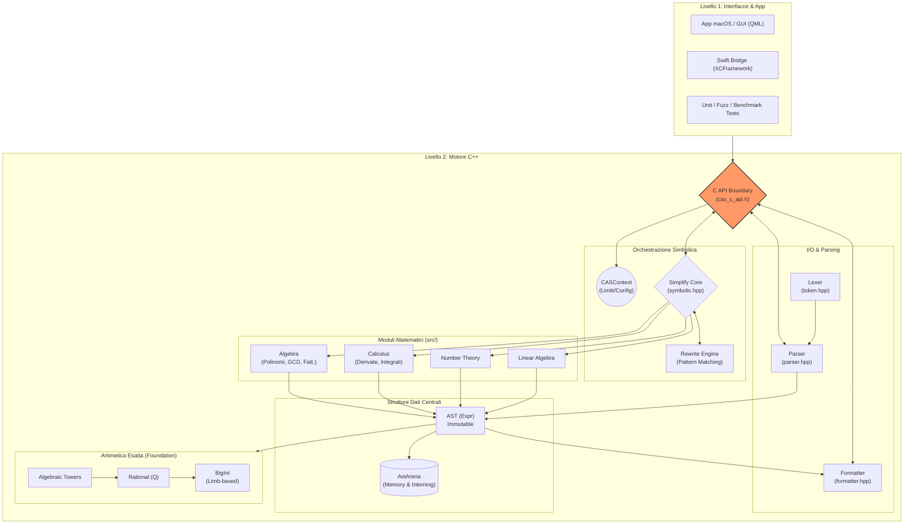

# Architettura Dettagliata di REAL CAS ENGINE C++

Questo documento fornisce una visione completa e profonda dell'architettura del progetto **REAL CAS ENGINE C++**. Il sistema è stato progettato come un motore di algebra computazionale (CAS) di livello industriale, scritto in C++20 moderno, con un'attenzione maniacale alla correttezza matematica, alle performance e alla sicurezza della memoria.

---

## 1. Principi Architetturali Fondamentali ("Technical Constitution")

L'intero progetto ruota attorno a queste regole inderogabili:
* **Zero-Hardcode Policy**: Nessuna costante arbitraria o limite fisso nel codice logico. Tutto deve avere una giustificazione formale e i limiti computazionali sono definiti dinamicamente tramite il `CASContext`.
* **Structural Sharing (Immutabilità)**: Gli alberi delle espressioni (`Expr`) sono strettamente immutabili. Se una funzione (es. semplificazione) non apporta modifiche, *deve* ritornare il puntatore originale. L'uguaglianza si verifica in $O(1)$ confrontando i puntatori.
* **Arena Allocation**: L'uso di `new` o `std::make_unique` per i nodi dell'AST è severamente proibito. Tutti i nodi sono gestiti da una `AstArena` che implementa *interning* (nodi identici condividono la stessa area di memoria).
* **Aritmetica Esatta**: Tutta l'aritmetica interna simbolica è basata su numeri a precisione arbitraria (`BigInt`, `Rational`). Tipi nativi come `int64_t` o `double` sono vietati nel core simbolico.
* **Gestione degli Errori Monadica**: Nessun costrutto `throw/catch`. Si utilizza `Result<T>` per restituire valori o errori in modo sicuro e tracciabile.

---

## 2. Diagramma di Flusso Grafico (Mermaid)



---

## 3. Mappatura Livelli e Struttura dei File

L'architettura riflette perfettamente l'organizzazione delle directory nel repository:

| Livello Architetturale | Descrizione | Riferimenti Principali nel Codice |
| :--- | :--- | :--- |
| **1. Frontend & Binding** | Il confine esterno del sistema. Consente a UI e linguaggi terzi di interagire in sicurezza tramite API C stabili, garantendo la retrocompatibilità ABI. | `include/cas_c_api.h`, `src/cas_c_api.cpp`, cartelle `Swift/`, `GUI/`, `macos-cpp/` |
| **2. I/O (Lexer/Parser)** | Si occupa di tradurre stringhe di testo in alberi sintattici astratti e viceversa. Il parser implementa discesa ricorsiva (o Pratt parsing). | `include/cas/lexer.hpp`, `include/cas/parser.hpp`, `include/cas/formatter.hpp` |
| **3. Motore Simbolico** | È il controllore del traffico. Configurato dal `CASContext`, riceve espressioni e applica regole di trasformazione (tramite il modulo di *Rewrite*) e valutazione delle assunzioni (es. "x è reale"). | `include/cas/symbolic.hpp`, `include/cas/cas_context_params.hpp`, `src/symbolic/` |
| **4. Moduli Matematici** | Contengono le logiche algoritmiche "pesanti". L'algebra gestisce scomposizioni polinomiali e MCD euristici/modulari. Il calcolo implementa Risch/Hermite per gli integrali e Gruntz per i limiti. | Directory `src/algebra/`, `src/calculus/`, `src/numtheory/`, `src/linalg/` |
| **5. Core AST & Arena** | Fornisce la rappresentazione dei dati. `AstArena` è il gestore della memoria centrale. Ogni nodo espressione creato vi viene registrato. | `include/cas/ast.hpp`, `include/cas/expr.hpp` |
| **6. Foundation** | Modulo aritmetico zero-dipendenze per la massima precisione senza perdita di informazioni e tolleranza all'overflow. | `include/cas/bigint.hpp`, `include/cas/rational.hpp`, `src/foundation/` |

---

## 4. Ciclo di vita di un'Espressione (Esempio: Derivata)

Cosa succede "sotto il cofano" quando un utente chiede di calcolare la derivata `diff(x^2, x)`?

1. **Input**: La stringa `"diff(x^2, x)"` entra dalla CLI o dalla GUI e passa attraverso l'API C.
2. **Lexing & Parsing**: Il `Lexer` scompone in token (`ID(diff)`, `(`, `ID(x)`, `^`, `NUM(2)`, `,`, `ID(x)`, `)`). Il `Parser` costruisce l'albero iniziale richiedendo i nodi all'`AstArena`. L'albero è immutabile.
3. **Dispatcher (Simplify)**: Il `CASContext` invia l'albero alla funzione di semplificazione. Il `Rewrite Engine` riconosce la funzione built-in `diff`.
4. **Modulo Calculus**: L'engine delega la chiamata al modulo specializzato in `src/calculus/`. L'algoritmo di derivazione simbolica applica la "Power Rule" (regola della potenza).
5. **Costruzione del Risultato**: Il modulo `Calculus` richiede all'`AstArena` la creazione di un nuovo nodo: `2 * x`. Se questo nodo è già stato calcolato in passato, l'Arena (grazie all'interning) restituisce il puntatore esistente in $O(1)$.
6. **Formattazione e Output**: L'albero risultante viene passato al `Formatter` che lo converte in stringa `"2*x"` o in rappresentazione grafica (LaTeX/QML) da rimandare alla UI.

---

## 5. Diagramma ASCII / Topologico Strutturale

Per documentazione offline o lettura da terminale testuale, la topologia di sistema è rappresentata con esattezza qui:

```text
+=============================================================================+
| 1. INTERFACCE UTENTE E BINDING (Boundary Esterno)                           |
|-----------------------------------------------------------------------------|
| [ macOS GUI (QML/C++) ] <-> [ Swift XCFramework ] <--> [ C API Boundary ]   |
| [ Strumenti CLI / Test] <----------------------------> [ cas_c_api.h    ]   |
+=============================================================================+
                                      | (Passaggio stringhe / ID Alberi)
                                      v
+=============================================================================+
| 2. TRADUZIONE I/O (Testo <-> Strutture C++)                                 |
|-----------------------------------------------------------------------------|
| Input Utente ---> [ Lexer ] ---> [ Parser ] ==================> (Crea AST)  |
| Output UI    <--- [ Formatter (es. LaTeX/Testo) ] <============ (Legge AST) |
+=============================================================================+
                                      |
                                      v
+=============================================================================+
| 3. MOTORE DI ORCHESTRAZIONE (Core Simbolico)                                |
|-----------------------------------------------------------------------------|
| [ CASContext ] (Inietta timeout, precisione, e limiti computazionali)       |
|       |                                                                     |
|       v                                                                     |
| [ Simplify / Eval Engine ] <============> [ Assunzioni (Es. "x è Reale") ]  |
|       |                                                                     |
|       +---------------------------------> [ Rewrite Engine (Pattern Match)] |
+=============================================================================+
                                      | (Delega operazioni dominio-specifiche)
                                      v
+=============================================================================+
| 4. DOMINI MATEMATICI (Logica Algoritmica Specializzata)                     |
|-----------------------------------------------------------------------------|
| [ ALGEBRA ]     [ CALCULUS ]      [ LINALG ]      [ NUMTHEORY ] [ NUMERIC ] |
| - Polinomi      - Derivate        - Matrici       - Primi       - Intervalli|
| - GCD           - Integrali Risch - Determinante  - Galois      - Fallback  |
| - Fattorizzaz.  - Limiti Gruntz     Bareiss                       Floating  |
+=============================================================================+
                                      | (Gli algoritmi allocano/leggono nodi)
                                      v
+=============================================================================+
| 5. AST & GESTIONE DELLA MEMORIA (Zero frammentazione)                       |
|-----------------------------------------------------------------------------|
| [ AST Nodi (Add, Mul, Pow, Symbol...) ] ---> RIGOROSAMENTE IMMUTABILI       |
|                                                                             |
| [ AstArena ] -> Centralizza allocazioni. Implementa l'Interning globale.    |
|                 (Nodi uguali = stesso puntatore). Vietato std::make_unique. |
+=============================================================================+
                                      | (I nodi di base AST sono numeri)
                                      v
+=============================================================================+
| 6. FONDAZIONE ARITMETICA ESATTA (Tipi foglia)                               |
|-----------------------------------------------------------------------------|
| [ BigInt ] <--- [ Rational (Q) ] <--- [ Algebraic Towers (Radici, estens) ] |
| (Arit. arbitraria Limb-based, nessuna dipendenza da tipi C come int64_t)    |
|                                                                             |
| [ BigFloat (R) ] per valutazioni di prossimità o fallback.                  |
+=============================================================================+
```

## Strumenti di Analisi Integrati

Questo sistema integra strumenti di ispezione continua per la manutenzione architetturale:
- **Graphify**: Generatore di Knowledge Graph del codice (cartella `graphify-out/`). Utile per interrogare le relazioni tra file o individuare "God Nodes" (colli di bottiglia architetturali).
- **Sanitizers & Benchmarks**: Script come `benchmark.sh` monitorano le prestazioni release vs baseline, mentre `ctest` gira costantemente con ASan/UBSan per impedire memory leak causati dalla `AstArena`.
